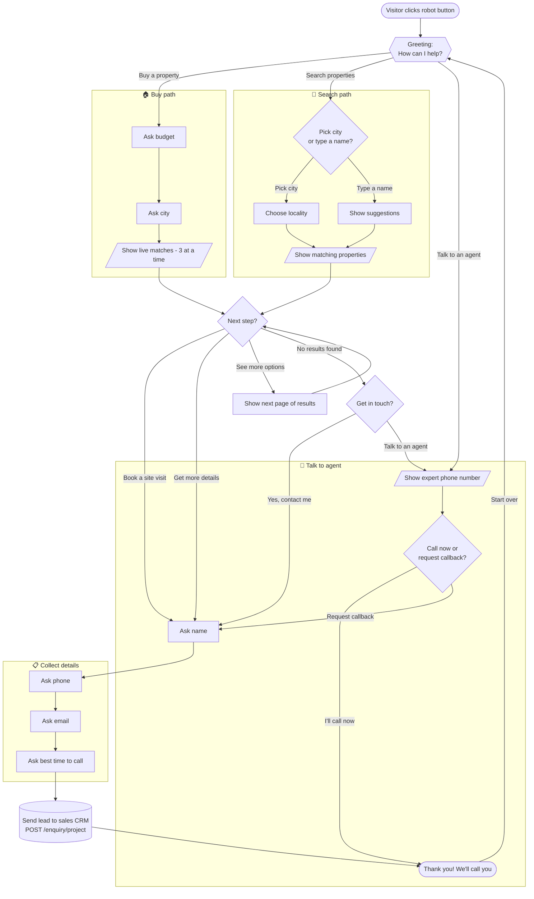
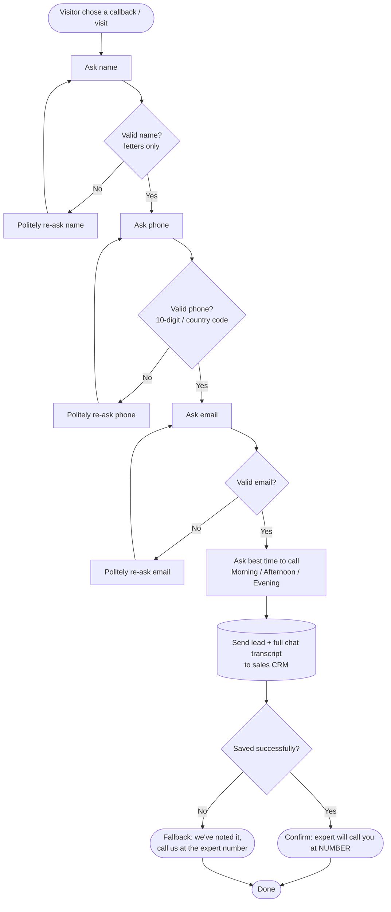
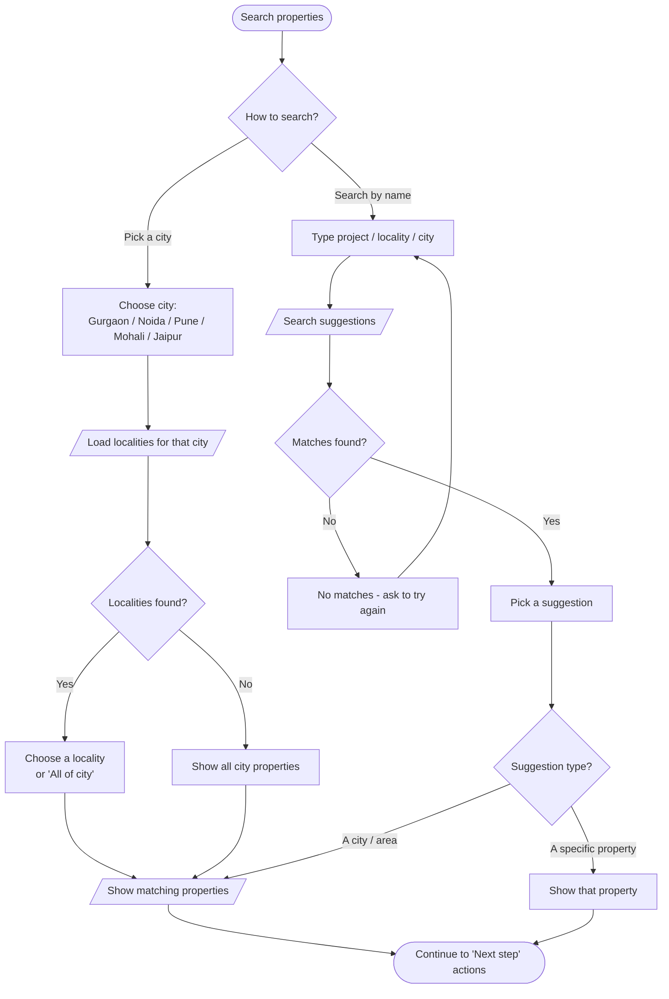
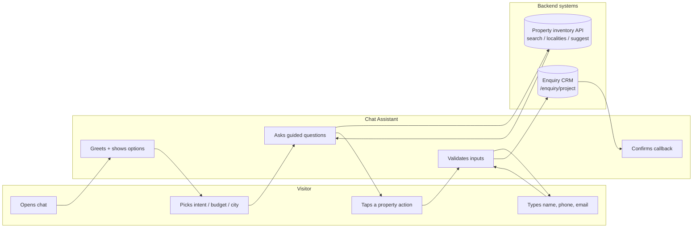

# Chat Assistant — Flow Diagrams for Lucidchart

This file contains the AI chat-bot flow written as **Mermaid** diagrams that you
can import straight into Lucidchart. Copy a code block, paste it into Lucidchart,
and it draws the chart for you — no manual boxes/arrows.

---

## ⭐ Quick links — view the diagrams now

> **Note:** A `lucid.app` share link can only be created from inside a logged-in
> Lucidchart account, so it can't be generated here. The links below render the
> **same diagrams as live images / editable charts** — open them instantly, no
> login needed. To get them *into* Lucidchart, use the **Import** steps further
> down (Lucidchart turns the Mermaid code into native editable shapes).

**Diagram 1 — Full bot flow**
- 🖼️ View image: <https://mermaid.ink/img/Zmxvd2NoYXJ0IFRECiAgICBTdGFydChbVmlzaXRvciBjbGlja3Mgcm9ib3QgYnV0dG9uXSkgLS0+IEdyZWV0aW5ne3tHcmVldGluZzogSG93IGNhbiBJIGhlbHA/fX0KICAgIEdyZWV0aW5nIC0tPnxCdXkgYSBwcm9wZXJ0eXwgQnV5W0FzayBidWRnZXRdCiAgICBHcmVldGluZyAtLT58U2VhcmNoIHByb3BlcnRpZXN8IFNlYXJjaHtQaWNrIGNpdHkgb3IgdHlwZSBhIG5hbWV9CiAgICBHcmVldGluZyAtLT58VGFsayB0byBhbiBhZ2VudHwgQWdlbnRbL1Nob3cgZXhwZXJ0IHBob25lIG51bWJlci9dCiAgICBCdXkgLS0+IEJ1eUNpdHlbQXNrIGNpdHldCiAgICBCdXlDaXR5IC0tPiBCdXlSZXN1bHRzWy9TaG93IGxpdmUgbWF0Y2hlcyAzIGF0IGEgdGltZS9dCiAgICBTZWFyY2ggLS0+fFBpY2sgY2l0eXwgTG9jW0Nob29zZSBsb2NhbGl0eV0KICAgIFNlYXJjaCAtLT58VHlwZSBhIG5hbWV8IFN1Z2dlc3RbU2hvdyBzdWdnZXN0aW9uc10KICAgIExvYyAtLT4gU2VhcmNoUmVzdWx0c1svU2hvdyBtYXRjaGluZyBwcm9wZXJ0aWVzL10KICAgIFN1Z2dlc3QgLS0+IFNlYXJjaFJlc3VsdHMKICAgIEFnZW50IC0tPiBBZ2VudENob2ljZXtDYWxsIG5vdyBvciByZXF1ZXN0IGNhbGxiYWNrfQogICAgQWdlbnRDaG9pY2UgLS0+fENhbGwgbm93fCBEb25lCiAgICBBZ2VudENob2ljZSAtLT58UmVxdWVzdCBjYWxsYmFja3wgTGVhZAogICAgQnV5UmVzdWx0cyAtLT4gTmV4dFN0ZXB7TmV4dCBzdGVwfQogICAgU2VhcmNoUmVzdWx0cyAtLT4gTmV4dFN0ZXAKICAgIE5leHRTdGVwIC0tPnxCb29rIGEgc2l0ZSB2aXNpdHwgTGVhZFtBc2sgbmFtZV0KICAgIE5leHRTdGVwIC0tPnxHZXQgbW9yZSBkZXRhaWxzfCBMZWFkCiAgICBOZXh0U3RlcCAtLT58U2VlIG1vcmUgb3B0aW9uc3wgTW9yZVBhZ2VbTmV4dCBwYWdlXSAtLT4gTmV4dFN0ZXAKICAgIE5leHRTdGVwIC0tPnxObyByZXN1bHRzfCBOb1Jlc3tHZXQgaW4gdG91Y2h9CiAgICBOb1JlcyAtLT58WWVzIGNvbnRhY3QgbWV8IExlYWQKICAgIE5vUmVzIC0tPnxUYWxrIHRvIGFuIGFnZW50fCBBZ2VudAogICAgTGVhZCAtLT4gUGhvbmVbQXNrIHBob25lXSAtLT4gRW1haWxbQXNrIGVtYWlsXSAtLT4gVGltZVtBc2sgYmVzdCB0aW1lXQogICAgVGltZSAtLT4gU3VibWl0WyhTZW5kIGxlYWQgdG8gc2FsZXMgQ1JNKV0KICAgIFN1Ym1pdCAtLT4gRG9uZShbVGhhbmsgeW91IHdlIHdpbGwgY2FsbCB5b3VdKQogICAgRG9uZSAtLT58U3RhcnQgb3ZlcnwgR3JlZXRpbmcK?type=png>
- ✏️ Open & edit: <https://mermaid.live/edit#base64:Zmxvd2NoYXJ0IFRECiAgICBTdGFydChbVmlzaXRvciBjbGlja3Mgcm9ib3QgYnV0dG9uXSkgLS0+IEdyZWV0aW5ne3tHcmVldGluZzogSG93IGNhbiBJIGhlbHA/fX0KICAgIEdyZWV0aW5nIC0tPnxCdXkgYSBwcm9wZXJ0eXwgQnV5W0FzayBidWRnZXRdCiAgICBHcmVldGluZyAtLT58U2VhcmNoIHByb3BlcnRpZXN8IFNlYXJjaHtQaWNrIGNpdHkgb3IgdHlwZSBhIG5hbWV9CiAgICBHcmVldGluZyAtLT58VGFsayB0byBhbiBhZ2VudHwgQWdlbnRbL1Nob3cgZXhwZXJ0IHBob25lIG51bWJlci9dCiAgICBCdXkgLS0+IEJ1eUNpdHlbQXNrIGNpdHldCiAgICBCdXlDaXR5IC0tPiBCdXlSZXN1bHRzWy9TaG93IGxpdmUgbWF0Y2hlcyAzIGF0IGEgdGltZS9dCiAgICBTZWFyY2ggLS0+fFBpY2sgY2l0eXwgTG9jW0Nob29zZSBsb2NhbGl0eV0KICAgIFNlYXJjaCAtLT58VHlwZSBhIG5hbWV8IFN1Z2dlc3RbU2hvdyBzdWdnZXN0aW9uc10KICAgIExvYyAtLT4gU2VhcmNoUmVzdWx0c1svU2hvdyBtYXRjaGluZyBwcm9wZXJ0aWVzL10KICAgIFN1Z2dlc3QgLS0+IFNlYXJjaFJlc3VsdHMKICAgIEFnZW50IC0tPiBBZ2VudENob2ljZXtDYWxsIG5vdyBvciByZXF1ZXN0IGNhbGxiYWNrfQogICAgQWdlbnRDaG9pY2UgLS0+fENhbGwgbm93fCBEb25lCiAgICBBZ2VudENob2ljZSAtLT58UmVxdWVzdCBjYWxsYmFja3wgTGVhZAogICAgQnV5UmVzdWx0cyAtLT4gTmV4dFN0ZXB7TmV4dCBzdGVwfQogICAgU2VhcmNoUmVzdWx0cyAtLT4gTmV4dFN0ZXAKICAgIE5leHRTdGVwIC0tPnxCb29rIGEgc2l0ZSB2aXNpdHwgTGVhZFtBc2sgbmFtZV0KICAgIE5leHRTdGVwIC0tPnxHZXQgbW9yZSBkZXRhaWxzfCBMZWFkCiAgICBOZXh0U3RlcCAtLT58U2VlIG1vcmUgb3B0aW9uc3wgTW9yZVBhZ2VbTmV4dCBwYWdlXSAtLT4gTmV4dFN0ZXAKICAgIE5leHRTdGVwIC0tPnxObyByZXN1bHRzfCBOb1Jlc3tHZXQgaW4gdG91Y2h9CiAgICBOb1JlcyAtLT58WWVzIGNvbnRhY3QgbWV8IExlYWQKICAgIE5vUmVzIC0tPnxUYWxrIHRvIGFuIGFnZW50fCBBZ2VudAogICAgTGVhZCAtLT4gUGhvbmVbQXNrIHBob25lXSAtLT4gRW1haWxbQXNrIGVtYWlsXSAtLT4gVGltZVtBc2sgYmVzdCB0aW1lXQogICAgVGltZSAtLT4gU3VibWl0WyhTZW5kIGxlYWQgdG8gc2FsZXMgQ1JNKV0KICAgIFN1Ym1pdCAtLT4gRG9uZShbVGhhbmsgeW91IHdlIHdpbGwgY2FsbCB5b3VdKQogICAgRG9uZSAtLT58U3RhcnQgb3ZlcnwgR3JlZXRpbmcK>

**Diagram 2 — Lead capture & validation**
- 🖼️ View image: <https://mermaid.ink/img/Zmxvd2NoYXJ0IFRECiAgICBBKFtWaXNpdG9yIGNob3NlIGNhbGxiYWNrIG9yIHZpc2l0XSkgLS0+IE5bQXNrIG5hbWVdCiAgICBOIC0tPiBOb2t7VmFsaWQgbmFtZX0KICAgIE5vayAtLT58Tm98IE5lcnJbUmUtYXNrIG5hbWVdIC0tPiBOCiAgICBOb2sgLS0+fFllc3wgUFtBc2sgcGhvbmVdCiAgICBQIC0tPiBQb2t7VmFsaWQgcGhvbmV9CiAgICBQb2sgLS0+fE5vfCBQZXJyW1JlLWFzayBwaG9uZV0gLS0+IFAKICAgIFBvayAtLT58WWVzfCBFW0FzayBlbWFpbF0KICAgIEUgLS0+IEVva3tWYWxpZCBlbWFpbH0KICAgIEVvayAtLT58Tm98IEVlcnJbUmUtYXNrIGVtYWlsXSAtLT4gRQogICAgRW9rIC0tPnxZZXN8IFRbQXNrIGJlc3QgdGltZSB0byBjYWxsXQogICAgVCAtLT4gU1soU2VuZCBsZWFkIGFuZCBjaGF0IHRyYW5zY3JpcHQgdG8gQ1JNKV0KICAgIFMgLS0+IE9Le1NhdmVkIHN1Y2Nlc3NmdWxseX0KICAgIE9LIC0tPnxZZXN8IEMxKFtDb25maXJtIGV4cGVydCB3aWxsIGNhbGwgeW91XSkKICAgIE9LIC0tPnxOb3wgQzIoW0ZhbGxiYWNrIGNhbGwgdXMgYXQgZXhwZXJ0IG51bWJlcl0pCiAgICBDMSAtLT4gRChbRG9uZV0pCiAgICBDMiAtLT4gRAo=?type=png>
- ✏️ Open & edit: <https://mermaid.live/edit#base64:Zmxvd2NoYXJ0IFRECiAgICBBKFtWaXNpdG9yIGNob3NlIGNhbGxiYWNrIG9yIHZpc2l0XSkgLS0+IE5bQXNrIG5hbWVdCiAgICBOIC0tPiBOb2t7VmFsaWQgbmFtZX0KICAgIE5vayAtLT58Tm98IE5lcnJbUmUtYXNrIG5hbWVdIC0tPiBOCiAgICBOb2sgLS0+fFllc3wgUFtBc2sgcGhvbmVdCiAgICBQIC0tPiBQb2t7VmFsaWQgcGhvbmV9CiAgICBQb2sgLS0+fE5vfCBQZXJyW1JlLWFzayBwaG9uZV0gLS0+IFAKICAgIFBvayAtLT58WWVzfCBFW0FzayBlbWFpbF0KICAgIEUgLS0+IEVva3tWYWxpZCBlbWFpbH0KICAgIEVvayAtLT58Tm98IEVlcnJbUmUtYXNrIGVtYWlsXSAtLT4gRQogICAgRW9rIC0tPnxZZXN8IFRbQXNrIGJlc3QgdGltZSB0byBjYWxsXQogICAgVCAtLT4gU1soU2VuZCBsZWFkIGFuZCBjaGF0IHRyYW5zY3JpcHQgdG8gQ1JNKV0KICAgIFMgLS0+IE9Le1NhdmVkIHN1Y2Nlc3NmdWxseX0KICAgIE9LIC0tPnxZZXN8IEMxKFtDb25maXJtIGV4cGVydCB3aWxsIGNhbGwgeW91XSkKICAgIE9LIC0tPnxOb3wgQzIoW0ZhbGxiYWNrIGNhbGwgdXMgYXQgZXhwZXJ0IG51bWJlcl0pCiAgICBDMSAtLT4gRChbRG9uZV0pCiAgICBDMiAtLT4gRAo=>

*(The `mermaid.live` "Open & edit" links also export PNG/SVG via **Actions → PNG/SVG** if you want an image file to drop into a slide or Lucidchart canvas.)*

---

## How to import into Lucidchart

1. Open your Lucidchart document.
2. Top menu → **Insert** → **Diagram as Code** (also called **Mermaid**).
   - *(Older UI: **File → Import Diagram → Mermaid**.)*
3. **Delete the sample text**, then paste **one** code block from below
   (everything between the ```` ```mermaid ```` lines, without those fence lines).
4. Click **Import**. Lucidchart converts it into editable shapes you can
   restyle, recolour, and move.

> Import the diagrams **one at a time** (Lucidchart imports one Mermaid graph per
> insert). Start with **Diagram 1** for the full overview.

> Prefer a different tool? The same code also renders on
> [mermaid.live](https://mermaid.live) (paste → export PNG/SVG), in GitHub
> Markdown, Notion, and draw.io (Arrange → Insert → Advanced → Mermaid).

---

## Diagram 1 — Full bot flow (overview)



---

## Diagram 2 — Lead capture & validation (zoom-in)



---

## Diagram 3 — Search path (city → locality → results)



---

## Diagram 4 — Swimlane: who does what (visitor vs assistant vs systems)



---

## Suggested colours in Lucidchart (optional)

After import, select shapes and apply these fills to match the brand and make
the chart scannable:

| Step type | Suggested colour | Hex |
|-----------|------------------|-----|
| Start / End (rounded) | Navy | `#1F2A44` |
| Questions / decisions (diamonds) | Gold | `#D69D2E` |
| Bot messages (rectangles) | Light grey | `#F3F4F7` |
| System / API (database shape) | Green | `#25D366` |
| Error / re-ask | Soft red | `#FFE5E5` |

---

## Notes that affect the diagram

- The **Rent / PG** branch exists in the code but is currently **hidden** from
  the opening menu, so it is not drawn above. If it's switched on, add a fourth
  arrow from *Greeting* → *Ask monthly rent* → *Ask city* → *Show rentals*
  (it mirrors the Buy path).
- "Show live matches" always pulls **real, current inventory** for the chosen
  city/budget — not a fixed list.
- Every callback path ends by sending the lead **plus the full chat transcript**
  to the sales CRM.

---

*Plain-language overview: [`CHATBOT_GUIDE_SIMPLE.md`](./CHATBOT_GUIDE_SIMPLE.md)
· Example conversations: [`CHATBOT_FLOW_SCENARIOS.md`](./CHATBOT_FLOW_SCENARIOS.md)
· Technical reference: [`CHATBOT_FLOW.md`](./CHATBOT_FLOW.md)*
